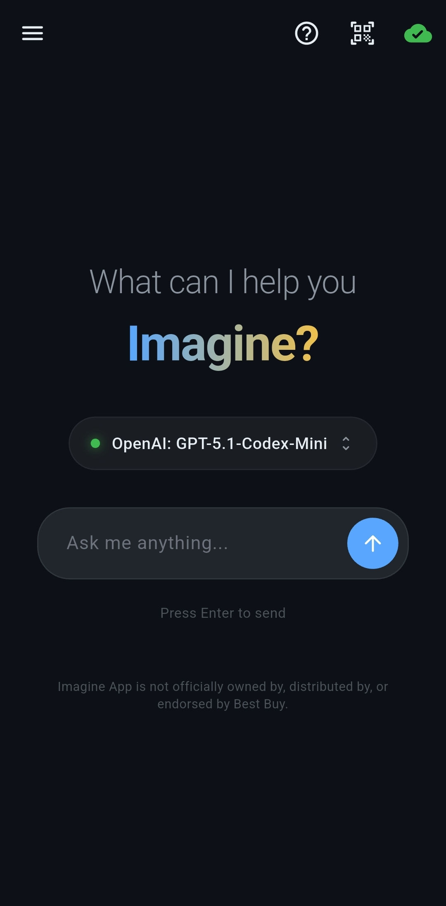
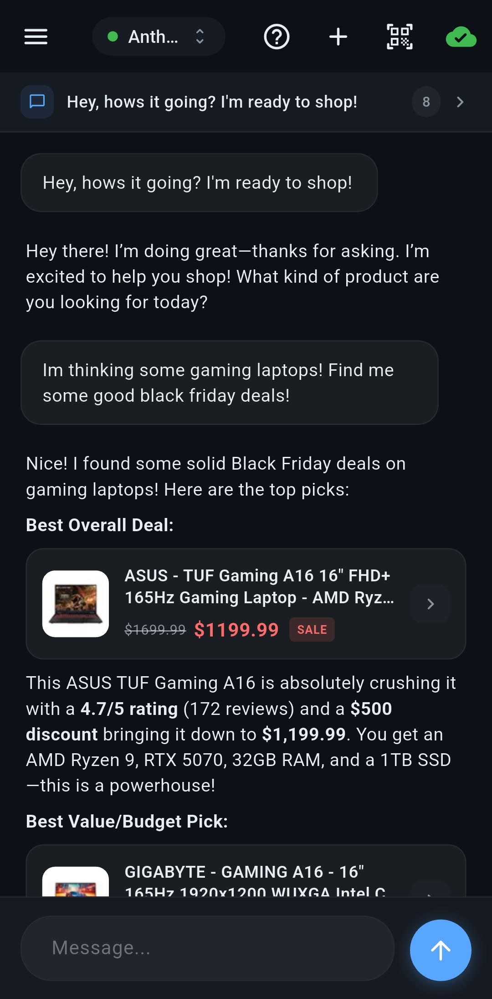

#  Imagine App - Best Buy Shopping Assistant

A mobile AI-powered shopping assistant that leverages Best Buy's public APIs and agentic AI to help with product discovery, recommendations, and information lookup. Built to solve real problems I encountered working as a sales associate at Best Buy.

<table>
  <tr>
    <td></td>
    <td></td>
    <td>
      <b>Clean, intuitive mobile UI</b><br><br>
      • Chat interface with rich product cards<br>
      • One-tap product details and barcode scan<br>
      • Choose from 200+ LLM models in settings<br>
      • Dark theme makes it feel modern
    </td>
  </tr>
</table>

## The Problem

Working as a sales associate at Best Buy, I frequently encountered situations where:

- Customers needed quick product comparisons across different categories
- Finding specific products by barcode or SKU was tedious through the internal systems
- Answering detailed specification questions required navigating multiple screens
- Recommending products based on customer needs meant mentally juggling dozens of options

I built Imagine App to solve these problems by creating an intelligent assistant that can search, analyze, and recommend products conversationally. It's powered by the same public APIs that Best Buy makes available to developers.

## What's Inside

- **Agentic AI System:** A tool-calling architecture that allows LLMs to autonomously search for products, analyze specifications, and gather information before responding.
- **Best Buy API Client:** A full-featured Dart client for Best Buy's Products, Categories, and Stores APIs with a fluent builder pattern.
- **OpenRouter Integration:** OAuth PKCE authentication flow supporting 200+ LLM models from OpenAI, Anthropic, Google, and more.
- **Barcode Scanning:** Built-in mobile scanner for instant product lookups via UPC.
- **Rich Product Cards:** Tappable product displays with images, pricing, ratings, and availability.

## Quick Setup

1. On your Android phone, download and install the APK from the releases
2. Press the cloud icon in the corner (or tap "Connect OpenRouter")
3. Sign in or create an OpenRouter account
4. Authorize the app
5. In your OpenRouter account, add billing information to access paid models
6. Start chatting and asking about products!

## Architecture

### Agentic Loop

The core of Imagine App is the `AgentRunner`, which implements a classic agentic loop:

```
User Message → LLM → Tool Calls? → Execute Tools → LLM → ... → Final Response
```

The runner:
1. Sends the conversation history plus available tools to the LLM
2. Parses any tool calls from the response
3. Executes each tool and collects results
4. Feeds results back to the LLM for the next iteration
5. Repeats until the LLM responds without tool calls (max 10 iterations)

```dart
Stream<ChatMessage> run(List<ChatMessage> history, String userMessage) async* {
  // ... build messages with system prompt and history
  
  while (iterations < config.maxIterations) {
    final response = await _callLLM(apiKey, messages);
    final toolCalls = parseToolCalls(response);
    
    yield ChatMessage.assistant(content, toolCalls: toolCalls);
    
    if (toolCalls.isEmpty) return; // Done!
    
    for (final toolCall in toolCalls) {
      final result = await tool.execute(toolCall.arguments);
      yield ChatMessage.toolResult(toolCallId: toolCall.id, content: result);
    }
  }
}
```

### Tool System

Tools extend a base `Tool` class and define their interface via JSON Schema:

```dart
abstract class Tool {
  String get name;
  String get description;
  Map<String, dynamic> get parameters; // JSON Schema
  Future<String> execute(Map<String, dynamic> args);
}
```

Available tools:

| Tool | Purpose |
|------|---------|
| `search_products` | Search Best Buy catalog with filters (price, brand, rating, availability, sale status) |
| `analyze_product` | Get detailed specs for a specific product by SKU or UPC |


The tool schemas are automatically converted to OpenAI-compatible function definitions and sent with each LLM request. With just these 2 tools, the agentic AI gets an effortless ability to ground itself on real Best Buy product info, avoiding halucinations.

### Best Buy API Client

The `BestBuyClient` provides a fluent builder API for constructing complex product queries:

```dart
final client = BestBuyClient(apiKey: 'YOUR_API_KEY');

// Search with multiple filters
final results = await client.products()
    .search("gaming laptop")
    .priceRange(min: 800, max: 1500)
    .byManufacturer("ASUS")
    .onSale()
    .minRating(4.0)
    .sortBy(ProductSort.customerReviewAverage)
    .execute();

// Direct lookup by barcode
final product = await client.getProductByUpc("194253715375");

// Store availability by location
final availability = await client.getStoreAvailability(
  sku: 6525432,
  postalCode: '55423',
);
```

The client handles:
- Request construction with proper URL encoding
- Response parsing into typed Dart models
- Error handling with specific exception types
- Timeout and retry logic

### OpenRouter Integration

Authentication uses OAuth PKCE flow:

1. App generates a code verifier and challenge
2. User is redirected to OpenRouter's auth page
3. After authorization, app receives a code via deep link
4. Code is exchanged for an API key
5. Key is stored securely using `flutter_secure_storage`

This allows users to bring their own OpenRouter account and choose from any available model.

## Development Methodology

This project was built with a clear division of labor:

**AI-Assisted (Cursor with Claude):**
- Frontend UI/UX design and widget implementation
- Theme and styling decisions
- Markdown rendering and product card layouts

**Manual Implementation:**
- Agentic architecture (`AgentRunner`, `Tool`, `ToolRegistry`)
- Best Buy API client with fluent builder pattern
- OpenRouter OAuth flow and client
- Tool implementations and prompt engineering
- State management and chat persistence

The goal was to focus my time on the interesting architectural problems. How to structure an agentic system and how to design clean API clients while letting AI handle the more routine frontend work.

## Platform Support

| Platform | Status |
|----------|--------|
| Android | Supported (APK available) |
| iOS | Not yet built, but architecturally compatible |
| Web | Not supported (requires native features) |

The app currently ships as an Android APK. iOS support is architecturally possible. The codebase is standard Flutter with I don't believe any Android-specific code in the Dart layer, but I haven't gone through the iOS build and distribution process yet. Though anyone is free to attempt to compile the app to use on iOS.

## Building from Source

### Prerequisites

- Flutter SDK 3.10+
- A Best Buy API key ([Developer Portal](https://developer.bestbuy.com/))
- An OpenRouter account for LLM access

### Setup

1. Clone the repository
2. Run `flutter pub get`
3. Provide your Best Buy API key using one of these methods:

**Option A: Environment file (recommended for development)**

Create a `.env` file in the project root:

```bash
BESTBUY_API_KEY=your_api_key_here
```

Then build using the included VS Code tasks, or manually:

```bash
source .env && flutter run --dart-define=BESTBUY_API_KEY="$BESTBUY_API_KEY"
```

**Option B: Pass directly at build time**

```bash
flutter build apk --release --dart-define=BESTBUY_API_KEY="your_api_key_here"
```

The API key is injected at compile time via `--dart-define` and read in `lib/config/api_keys.dart` using `String.fromEnvironment()`. This keeps secrets out of the source code.

### Build Output

The APK will be at `build/app/outputs/flutter-apk/app-release.apk`.

## Important Notices

### Privacy Warning

**Do not enter any personal or customer information (PII).** Data sent to AI providers (via OpenRouter) is not private. The app's system prompt explicitly instructs the AI to warn users against sharing personal information and to refuse processing any customer PII.

### Disclaimer

This project is **NOT officially owned by, distributed by, or endorsed by Best Buy.** It is an independent, open-source tool created as a personal project.

**What this app does NOT do:**
- Access any internal, confidential, or proprietary Best Buy systems
- Use any private or employee-only APIs
- Store or process customer personal information
- Access inventory systems, employee tools, or POS data

**What this app DOES do:**
- Query Best Buy's publicly available [Developer APIs](https://developer.bestbuy.com/) (the same APIs available to any developer who registers)
- Send product queries to third-party LLM providers via OpenRouter
- Display publicly available product information (prices, specs, ratings, availability)

The app retrieves only stock and product information from official public-facing APIs that Best Buy makes available to external developers. Neither Best Buy nor the creator of this app assumes any liability for personal information shared with AI providers.

This is a personal productivity tool and open-source demonstration of agentic AI architecture, nothing more.
